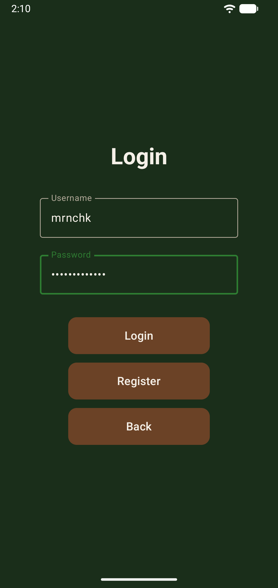
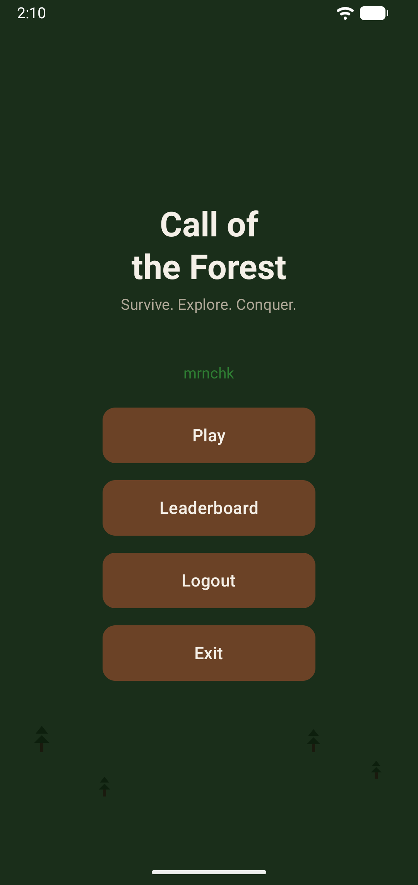
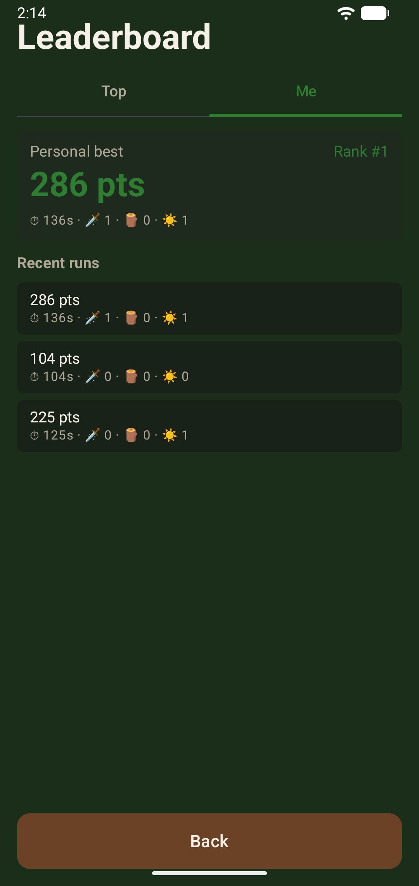
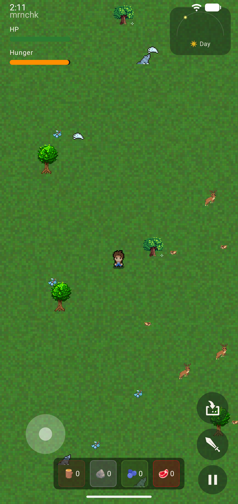
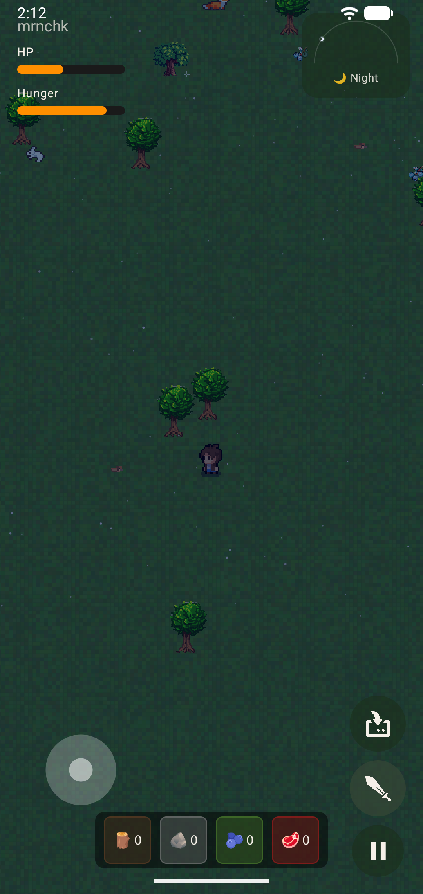
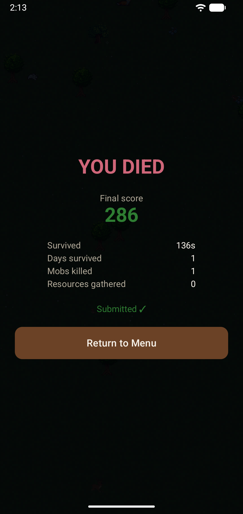

# Call of the forest

2D survival game для Android, разрабатываемая на Kotlin с использованием Jetpack Compose, Canvas API, Coroutines, Retrofit/OkHttp и Spring Boot backend.

## О проекте

Игра строится вокруг исследования 2D-мира, сбора ресурсов, боя с мобами, выживания, смены времени суток и лидерборда.

Проект использует UDF-подход для управления состоянием и адаптированную ECS-модель для игрового цикла. Основная идея архитектуры — отделить игровую логику от слоя отрисовки и хранить состояние игры в едином `GameState`.

## Основные возможности MVP

- Перемещение игрока по 2D-карте
- Отрисовка мира через Compose Canvas
- Базовые коллизии
- Ближний бой и расчет урона
- Инвентарь и сбор ресурсов
- Смена дня и ночи
- Голод, ночной холод и здоровье игрока
- AI мобов: патрулирование, преследование, атака и бегство
- Авторизация через JWT
- Лидерборд через backend API

## Скриншоты

<table>
  <tr>
    <td align="center">
      <br/>
      <sub>Авторизация</sub>
    </td>
    <td align="center">
      <br/>
      <sub>Главное меню</sub>
    </td>
    <td align="center">
      <br/>
      <sub>Лидерборд</sub>
    </td>
  </tr>
  <tr>
    <td align="center">
      <br/>
      <sub>Игровой процесс днём</sub>
    </td>
    <td align="center">
      <br/>
      <sub>Игровой процесс ночью</sub>
    </td>
    <td align="center">
      <br/>
      <sub>Экран смерти</sub>
    </td>
  </tr>
</table>

## Стек

| Категория | Технология |
| :--- | :--- |
| Язык | Kotlin |
| UI и рендер | Jetpack Compose, Canvas API |
| Асинхронность | Coroutines, Flow, StateFlow |
| Сеть | Retrofit, OkHttp |
| Хранение сессии | SharedPreferences |
| Backend | Spring Boot, PostgreSQL, JWT |

## Состав разработчиков

| Участник | Зона ответственности |
| :--- | :--- |
| Губанов Георгий | Core Engine & Physics |
| Елисеев Мирон | Entities Logic |
| Колесова Софья | Game stats & Leaderboard implementation |
| Подмарев Александр | Network & Services |
| Чернокульская Алина | UI, Meta & Progression |

## Документация

Подробное описание проекта вынесено в отдельные файлы репозитория:

- архитектура приложения (`docs/ARCHITECTURE.md`);
- процесс разработки (`docs/PROCESS_AND_TASKS.md`);
- план релизов MVP (`docs/MVP_MILESTONES.md`);
- стек технологий и инструментарий (`docs/TECH_STACK.md`);
- API сервера (`server/README.md`) — авторизация по JWT и лидерборд.

## Структура репозитория

```
client/   Android-приложение (Kotlin, Compose)
server/   Spring Boot бэкенд (JWT auth, PostgreSQL, лидерборд)
```

## Запуск (полный стек)

1. Поднять бэкенд (PostgreSQL + Spring Boot): см. [`server/README.md`](server/README.md).
2. Открыть `client/` в Android Studio и запустить на эмуляторе. Base URL клиента — `http://10.0.2.2:8080` (адрес хоста из стандартного эмулятора); для реального устройства заменить в `client/app/src/main/java/com/cotf/network/RetrofitClient.kt`.

## Тесты

```bash
cd server && ./gradlew test       # бэкенд
cd client && ./gradlew test       # клиент (нужен Android SDK)
```

## Статус

Проект находится в стадии MVP.

Готовые фичи:

- Одиночная партия с ИИ мобов, сбором ресурсов, голодом и сменой дня/ночи
- Авторизация (register / signin / refresh) через JWT
- Лидерборд — статистика партий (счёт, выживание, убитые мобы, ресурсы, дни) отправляется на сервер по окончании партии, экран Leaderboard с топом и личной статистикой