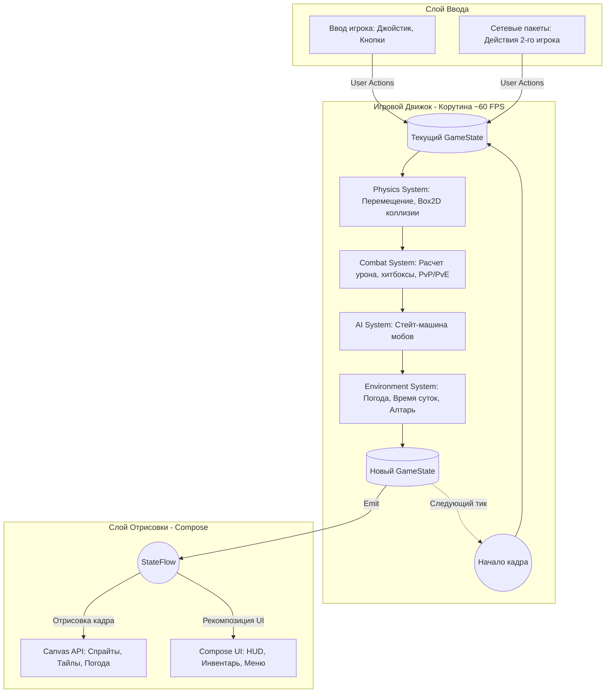
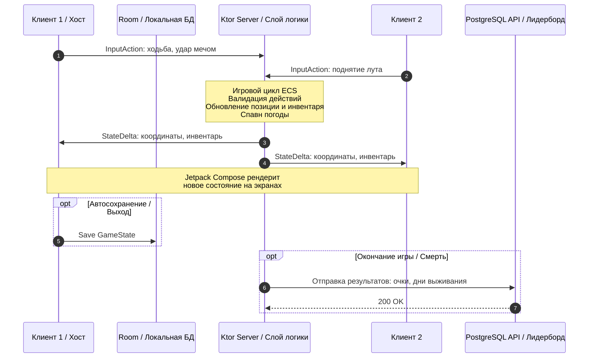
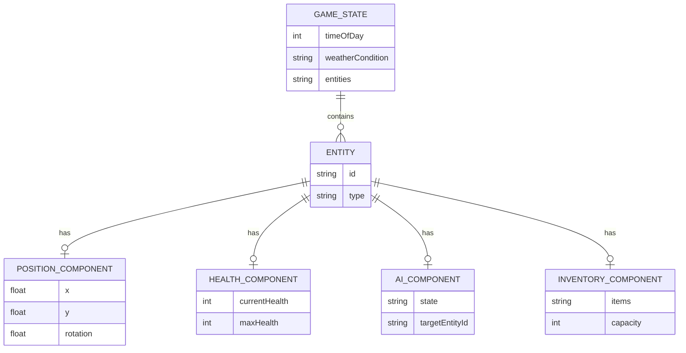

## Архитектура приложения

Проект построен на базе архитектурного паттерна UDF (Unidirectional Data Flow) в связке с адаптированным ECS (Entity-Component-System) для игрового цикла. Данный подход обеспечивает строгую изоляцию бизнес-логики от слоя отрисовки, что минимизирует состояние гонки (race conditions) при мультиплеере и обеспечивает высокую модульность кода.

### 1. Высокоуровневая схема (Game Loop & Render)

Игровой цикл (Game Loop) работает в отдельной корутине, изолированно от UI. Состояние игры иммутабельно, и каждый кадр (тик) генерируется новое состояние на основе действий игроков и работы внутренних систем.

### 2. Управление состоянием (State Management)
Единственным источником истины является GameState. Изменения применяются через чистые функции (pure functions), принимающие предыдущий GameState и Action, и возвращающие новый GameState. Отсутствие мутабельных переменных в бизнес-логике критически важно для предсказуемой интерполяции в мультиплеере и упрощает написание модульных тестов.

### 3. Топология мультиплеера (Client-Server over WebSockets)

Используется клиент-серверная модель на базе Ktor. Один из игроков (Хост) берет на себя вычисление основного игрового цикла и является авторитетным сервером, пресекая рассинхронизацию.

### 3. Топология мультиплеера (Client-Server over WebSockets)

### 4. Взаимодействие компонентов игры (ECS концепт)

Внутри GameState все объекты представлены в виде сущностей (Entities). Системы не хранят данные, а только фильтруют сущности по нужным компонентам и применяют к ним логику.

### 4. Взаимодействие компонентов игры (ECS концепт)

