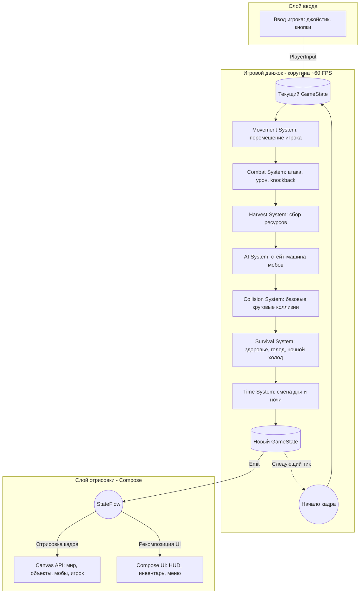
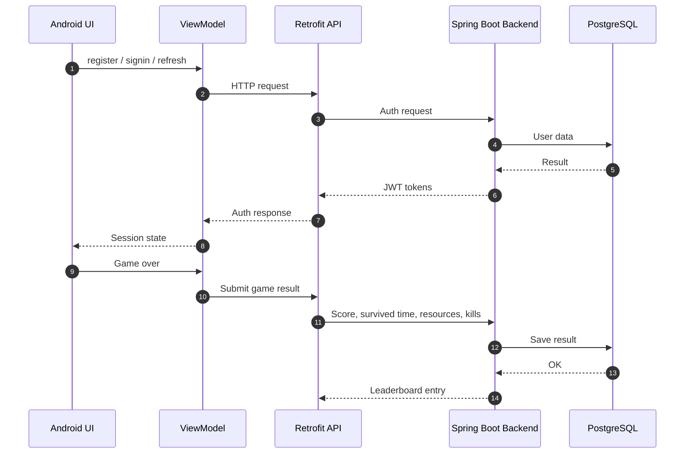
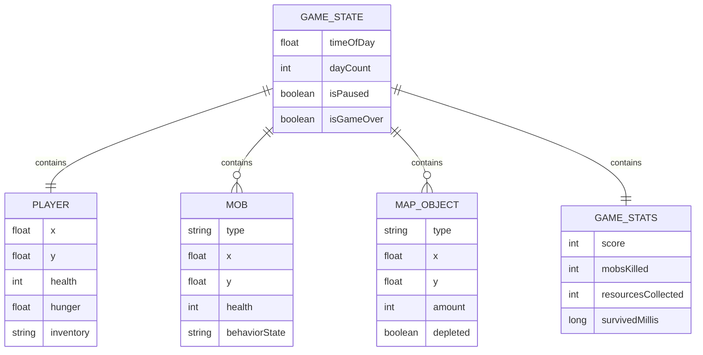

## Архитектура приложения

Проект построен на базе архитектурного паттерна UDF (Unidirectional Data Flow) в связке с адаптированным ECS (Entity-Component-System) для игрового цикла. Данный подход отделяет игровую логику от слоя отрисовки и упрощает работу с состоянием игры.

### 1. Высокоуровневая схема (Game Loop & Render)

Игровой цикл (Game Loop) работает в корутине. Состояние игры хранится в `GameState`, обновляется внутри `GameEngine` и передается в UI через `StateFlow`.

### 2. Управление состоянием (State Management)

Единственным источником истины является `GameState`. Он содержит данные игрока, мобов, объектов карты, времени, состояния паузы, game over и статистики партии.

`GameViewModel` держит состояние в `StateFlow`, принимает ввод пользователя и вызывает методы `GameEngine`. UI только отображает текущее состояние и отправляет пользовательские действия.

### 3. Сетевая интеграция

Клиент взаимодействует с backend через REST API на Retrofit/OkHttp.

### 4. Взаимодействие компонентов игры

Игровая логика разделена на независимые системы внутри `GameEngine`:

- перемещение игрока;
- атака и расчет урона;
- сбор ресурсов;
- употребление ягод;
- AI мобов;
- коллизии;
- голод, здоровье и ночной холод;
- смена времени суток;
- подсчет статистики партии.

